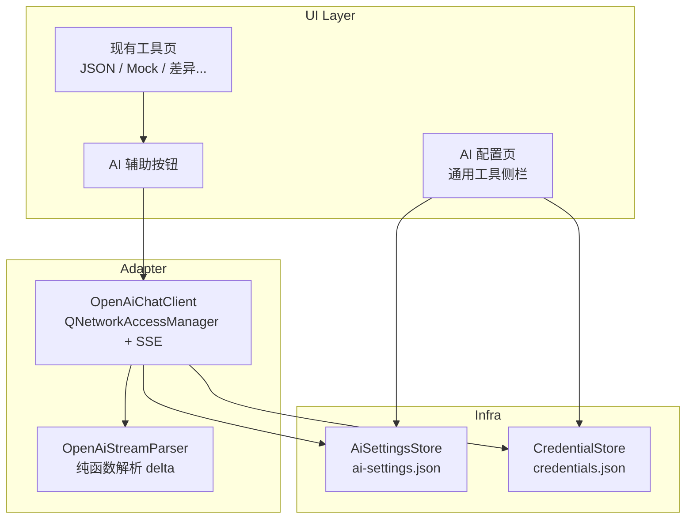

# AI 辅助功能接入方案

**Goal:** 在「通用工具」模块增加可页面配置的 AI 连接（URL / Key / 模型），通过 OpenAI 兼容 SSE 流式客户端，为现有工具提供「AI 辅助」能力。

**Scope:** 用户选定「在现有工具中嵌入 AI 辅助 + OpenAI 兼容接口 + 流式输出」。MVP 不包含独立 AI 聊天页；部署日志 AI 分析列为后续扩展。

**Status:** MVP 已实现（含 AI 聊天、部署日志分析、设置页快捷入口）。

---

## 目标与约束

- **目标**：用户可在页面配置 API Base URL、Key、模型；在现有通用工具（JSON、Mock、差异对比等）中一键调用 AI，流式显示结果。
- **API 形态**：OpenAI 兼容 `POST {baseUrl}/chat/completions`，`stream: true`，解析 SSE `data:` 行。
- **项目约束**（见 [AGENTS.md](../../AGENTS.md)）：
  - C++17 + Qt 6 Widgets
  - 敏感信息走 `CredentialStore`，网络逻辑放 adapter 层
  - 纯解析逻辑补 Qt Test；配置字段与 [schemas/ai-settings.schema.json](../../schemas/ai-settings.schema.json) 一致

---

## 架构概览



### 与现有功能的关系

| 现有能力 | AI 接入方式 |
|---------|------------|
| `AppSettingsStore` / 设置页 | 不混入 Maven 配置；AI 用独立 `ai-settings.json` |
| `CredentialStore` | API Key 存 `deploy-hub/ai-api-key`（与服务器密码同一机制） |
| `CommonToolsWidget` | 新增「AI 配置」页 + 为部分工具加「AI 辅助」按钮 |
| HTTP 请求调试 | 暂不合并；AI 走专用 adapter（Bearer + SSE） |
| `LogSanitizer` | 已覆盖 `apikey` / `Authorization`，AI 日志需走现有脱敏 |

---

## 一、配置层（URL / Key 页面可配）

### 1. AiSettingsStore

**文件：** `src/infra/AiSettingsStore.h` / `.cpp`

```cpp
struct AiSettings {
    QString apiBaseUrl;      // 例: https://api.openai.com/v1
    QString model;           // 例: gpt-4o-mini
    QString credentialRef;   // 默认 deploy-hub/ai-api-key
    bool rememberKey = true;
};
```

- **持久化路径：** `{configDir}/ai-settings.json`（经 `DataPaths::configDir()`）
- **JSON 字段：** 见 [ai-settings.schema.json](../../schemas/ai-settings.schema.json)
- **Key 明文不入 JSON：** 勾选「记住 Key」时写入 `CredentialStore`；取消则 `remove(credentialRef)`

### 2. 「AI 配置」工具页

在 `CommonToolsWidget` 中新增 **侧栏第 1 项**（置顶）：

| 字段 | 控件 |
|------|------|
| API Base URL | `QLineEdit`（placeholder: `https://api.openai.com/v1`） |
| API Key | `QLineEdit::Password` + 显示/隐藏（复用 `ServerDialog` 模式） |
| 模型 | `QLineEdit`（placeholder: `gpt-4o-mini`） |
| 记住 Key | `QCheckBox` |
| 操作 | 「保存配置」「测试连接」 |

- `MainWindow` 向 `CommonToolsWidget` 注入 `CredentialStore*` 与 `AiSettingsStore`
- **测试连接：** 发送最小 `chat/completions`（`max_tokens: 1`, `stream: false`），验证 URL / Key / 模型

### 3. 兼容端点示例

| 厂商 | Base URL 示例 |
|------|--------------|
| OpenAI | `https://api.openai.com/v1` |
| DeepSeek | `https://api.deepseek.com/v1` |
| Ollama（OpenAI 兼容） | `http://127.0.0.1:11434/v1` |
| Azure OpenAI | `https://{resource}.openai.azure.com/openai/deployments/{deployment}` |

---

## 二、网络 Adapter（OpenAI 兼容 + 流式）

### 1. OpenAiChatClient

**文件：** `src/adapters/ai/OpenAiChatClient.h` / `.cpp`

职责：

- 请求体：`model`, `messages`, `stream: true`
- Header：`Authorization: Bearer {key}`, `Content-Type: application/json`
- URL：`{apiBaseUrl}/chat/completions`（自动 trim 尾部 `/`）
- 流式：`QNetworkReply::readyRead` 读 SSE，回调 `onDelta(QString chunk)`
- 结束：`[DONE]` 或 reply finished；支持 `abort()` 取消
- 错误：HTTP 状态 + 响应 JSON 的 `error.message`

**不引入 libcurl**：与 `CommonToolsWidget::buildHttpRequestPage` 一致，使用 Qt Network。

### 2. OpenAiStreamParser

**文件：** `src/tools/OpenAiStreamParser.h` / `.cpp`（或 `src/adapters/ai/`）

- 输入：SSE 文本块
- 输出：`std::optional<QString>` delta content
- 单测：正常 delta、空行、`[DONE]`、畸形 JSON

---

## 三、与现有工具结合（AI 辅助按钮）

扩展 `buildTextToolPage` 或新增 `buildTextToolPageWithAi(...)`，工具栏增加 **「AI 辅助」** + **「停止」**。

### 首批接入工具

| 工具 | AI 用途 | Prompt 要点 |
|------|---------|------------|
| JSON 格式化 | 修复/格式化非法 JSON | 输入区内容 → 只输出合法 JSON |
| 契约 Mock 数据 | 根据 schema/示例生成多组 Mock | 输入 JSON/描述 → JSON 数组 |
| 文件差异 | 自然语言总结 diff | 输入 diff 文本 → 中文摘要 |
| Cron 表达式 | 解释含义与下次执行 | 输入 cron → 中文说明 |

### 交互流程

1. 读取 `AiSettingsStore` + `CredentialStore`；未配置则提示先完成「AI 配置」
2. 点击「AI 辅助」→ 输出区清空 → 流式 append 到右侧 `QPlainTextEdit`
3. 请求期间禁用发送、启用「停止」
4. 失败时在 `toolMessage` 显示错误（非阻塞对话框）

**不替换**现有本地逻辑：「格式化」「生成 Mock」等按钮保留；AI 为增强路径，离线仍可用。

### 通用工具注册约定（沿用现有三处对齐）

1. `CommonToolsWidget` 构造函数 `m_stack->addWidget(...)` 顺序
2. `toolLabels()` 同名标签列表（同索引）
3. 文本工具 lambda 内按 `title` 分支；AI 辅助走独立 handler

---

## 四、改动清单

| 文件 | 改动 |
|------|------|
| `src/infra/AiSettingsStore.h/.cpp` | 新增 |
| `src/adapters/ai/OpenAiChatClient.h/.cpp` | 新增 |
| `src/tools/OpenAiStreamParser.h/.cpp` | 新增 |
| `src/ui/CommonToolsWidget.h/.cpp` | `buildAiConfigPage()`、AI 辅助 wiring、`toolLabels()` 增加「AI 配置」 |
| `src/ui/MainWindow.cpp` | 创建 `AiSettingsStore`；注入 `CommonToolsWidget` |
| `CMakeLists.txt` | 新源文件加入 `deploy_hub_core` / `deploy-hub` |
| `tests/unit/AiSettingsStoreTest.cpp` | 读写 JSON |
| `tests/unit/OpenAiStreamParserTest.cpp` | SSE 解析 |
| `tests/unit/main.cpp` | 注册测试 |
| `docs/schemas/ai-settings.schema.json` | 配置契约 |

### 可选后续（非 MVP）

- ~~**部署工具：** `DeploymentLogDialog` 增加「AI 分析日志」~~（已实现）
- ~~**设置页：** AI 配置快捷入口（只读链接，主编辑仍在 AI 配置页）~~（已实现）
- **通用工具：** 更多工具接入 AI 辅助（正则、HTTP 状态码等）

---

## 五、安全与体验

- Key 仅通过 `CredentialStore` 持久化；UI 加载时 `load(credentialRef)` 回填（编辑留空表示不修改）
- AI 请求/错误日志禁止打印完整 Key（依赖 `LogSanitizer`）
- 流式输出用 `QPlainTextEdit` 追加，避免整块 `setPlainText` 卡顿
- 超时：建议 60s（可配置常量），超时 `abort` 并提示

---

## 六、验证计划

1. `AiSettingsStoreTest` / `OpenAiStreamParserTest` 通过 `ctest`
2. Release 构建 `scripts/build-release.ps1`
3. 手动验证：
   - AI 配置页保存 URL / Key / 模型，重启后 Key 仍可用（remember 开启）
   - JSON 工具「AI 辅助」流式输出
   - 「停止」可中断；未配置时有明确提示
   - 对接 Ollama / OpenAI / DeepSeek 等 OpenAI 兼容端点（改 Base URL 即可）

---

## 实施顺序

1. **基础设施：** `AiSettingsStore` + `CredentialStore` 集成 + 单测
2. **Adapter：** `OpenAiStreamParser` + `OpenAiChatClient`（先非流式测试连接，再 SSE）
3. **AI 配置页：** URL / Key / 模型 / 保存 / 测试
4. **工具接入：** 先 JSON + Mock 验证流式辅助
5. **扩展：** 差异总结、Cron 解释；再考虑部署日志 AI

---

## Tasks（实现 checklist）

- [ ] 新增 `AiSettingsStore`（`ai-settings.json`）+ `AiSettingsStoreTest`；Key 走 `CredentialStore`
- [ ] 实现 `OpenAiStreamParser` + `OpenAiChatClient`（SSE 流式 + abort + 测试连接）
- [ ] `CommonToolsWidget` 新增「AI 配置」页；`MainWindow` 注入依赖
- [ ] 为 JSON 格式化、契约 Mock 等工具加「AI 辅助 / 停止」与流式输出
- [ ] 补单测、Release 构建与 OpenAI 兼容端点手动验证
